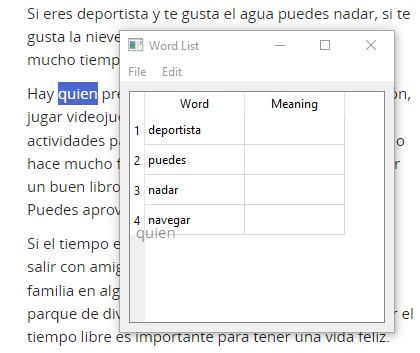
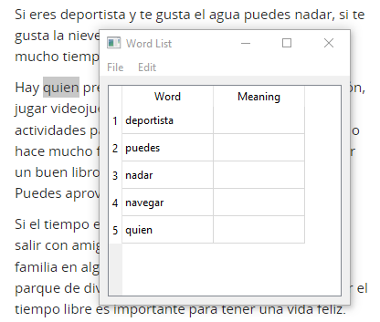
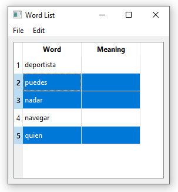
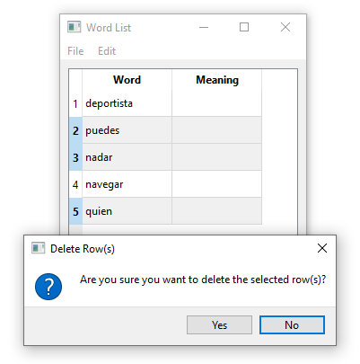
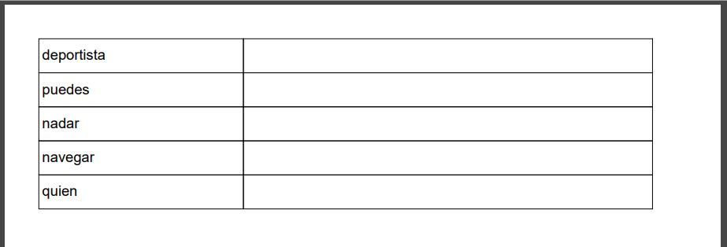
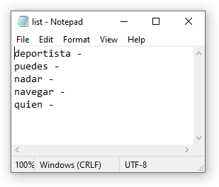

# Word List Application

> Simple and intuitive word list manager


A simple and intuitive application to create and manage word lists. Whether you're a language learner, a teacher, or simply someone who loves words, the Word List application provides an easy-to-use interface to drag, drop, and manage words and their meanings.

## Table of Contents

- [Features](#features)
- [Installation](#installation)
- [How to Use](#how-to-use)
- [Customizations and Settings](#customizations-and-settings)
- [Feedback and Contributions](#feedback-and-contributions)
- [License](#license)

## Features 🔬

- **Drag and Drop Words**: Simply drag any highlighted word from outside the application and drop it anywhere inside the application window to add it to your list.
- **Manage Word Lists**: Easily add, delete, or modify words and their meanings.
- **Export Lists**: Save your word lists as `.txt` or `.pdf` files for easy sharing and printing.

## Installation 🧰

To install the Word List application, you need to have Python installed on your computer. You can download Python [here](https://www.python.org/).

Once Python is installed, follow these steps:

1. **Clone the Repository**:
   Open a terminal or command prompt and run the following command:

   ```shell
   git clone https://github.com/di-marko/32-drag-words.git
   ```

2. **Navigate to the Project Directory**:

   ```shell
   cd word-list
   ```

3. **Install Dependencies**:
   Run the following command to install the required Python libraries:

   ```shell
   pip install fpdf PyQt5
   ```

4. **Run the Application**:
   Run the following command to start the application:

   ```shell
   python main.py
   ```

5. 🎉 **Done**:
   The application should now be running. You can start adding words to your list.

## How to Use 📚

1. **Add a Word**:

   - Drag and drop a word from outside the application to add it to your list.
   - Alternatively, use the `Add Row` option from the `Edit` menu or press the `Plus` key on your keyboard.<br>
     <br>
     <br><br>

2. **Delete a Word**:

   - Select/Deselect a word or multiple words just by clicking ONCE on a row. Use then `Delete Row(s)` option from the `Edit` menu or press the `Delete` key on your keyboard.<br>
     <br>
   - You'll be prompted to confirm the deletion.<br>
     <br><br>

3. **Save Your List**:
   - Go to `File` > `Save As` to save your word list.
   - Choose between `.txt` or `.pdf` formats.
     <br>
     _Example of `.pdf` file._<br><br>
     <br>
     _Example of `.txt` file._

## Feedback and Contributions 📧

Feedback, bug reports, and pull requests are welcome.

## License 🎨

Open Source. Feel free to use how you wish.
